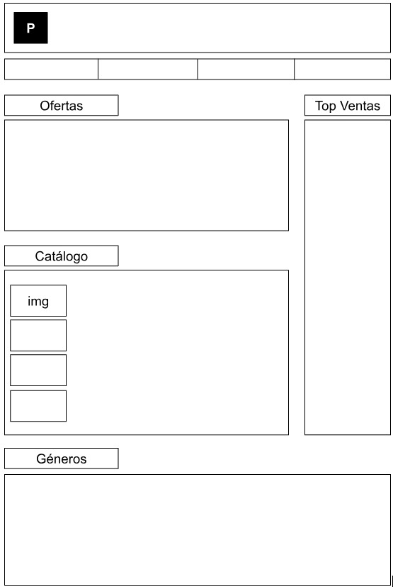

# **Documentació del Projecte**

Aquest document detalla tota la informació essencial sobre el projecte, des de la seva planificació fins al desenvolupament, ús, i millores futures.

---

## **0. Promoció**

### **Nom de l'aplicació**
Pixel Point

### **Descripció en una frase**
Una aplicació que ofereix una plataforma en línia innovadora per comprar, vendre i descobrir videojocs de totes les categories.].

### **Quí som**
Som Pixel Point, una empresa apassionada pel món dels videojocs i la tecnologia

### **Vídeo promocional**
link.

---

## **1. Planificació**

### **Necessitat de l'aplicació**
L'aplicació resol diverses necessitats clau del mercat:
- **Fragmentació del mercat de videojocs**: Els usuaris han de visitar múltiples plataformes per trobar ofertes o jocs específics.
- **Accés limitat a jocs independents**: Molts desenvolupadors indies tenen dificultats per arribar al públic objectiu en botigues grans.
- **Personalització insuficient**: Recomanacions genèriques que no s'adapten als gustos dels usuaris.

### **Altres solucions existents**
- **Steam**: Una plataforma líder en la venda de videojocs.  
  - **Pros**: Gran comunitat, moltes ofertes.  
  - **Contres**: Saturació de contingut, dificultats per a nous desenvolupadors.

- **Epic Games Store**: Competidor emergent amb exclusives atractives.  
  - **Pros**: Comissió més baixa per a desenvolupadors.  
  - **Contres**: Catàleg limitat i falta de funcionalitats socials avançades.

### **Principals funcionalitats**
1. **Cerca intel·ligent i personalitzada**: Recomanacions basades en les preferències de l'usuari i el seu historial de compres.
2. **Marketplace per a desenvolupadors indies**: Una secció dedicada als jocs independents amb eines de promoció senzilles i assequibles.
3. **Ofertes i subscripcions**: Ofertes diàries, bundles de jocs i un sistema de subscripció per accedir a un catàleg seleccionat.
4. **Valoracions i ressenyes integrades**: Permet als jugadors opinar i compartir les seves experiències de manera visual i fàcil.
5. **Funcions socials**: Perfil de jugador, connexions amb amics, i possibilitat de compartir col·leccions o llistes de desitjos.

### **Guia d'estil**
#### **Logo**

#### **Colors**
- Primari (Blanc): `#FFFFFF`
- Secundari (Negre): `#000000`

#### **Tipografies**
- Principal: [Pixel Operator]
- Secundària: [Pixel Operator]

#### **Icones**
Llistat dels paquets d'icones utilitzats.

#### **Layout**

---

## **2. Desenvolupament**

### **Tecnologies emprades**
- Frontend: [Html, css]
- Backend: [Java, Php]
- Base de dades: [MySQL,

